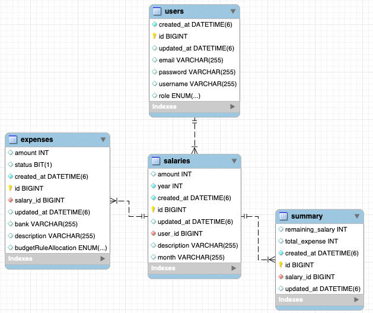

# Salary-Tracker

## Why I Built It

I needed a solution to **track my salary** in a way that fit my specific needs, but I couldn’t find an existing
application that provided exactly what I wanted. This project was created to:

- Provide a **customized salary tracking system**.
- Apply and deepen my knowledge in **Jakarta EE, Open Liberty**.

---

## Tech Stack

The project utilizes modern backend technologies to ensure **scalability, maintainability, and performance**.

| Technology               | Purpose                          |
|--------------------------|----------------------------------|
| **Java EE (Jakarta EE)** | Core backend logic               |
| **JAX-RS (REST API)**    | API development                  |
| **Open Liberty**         | Lightweight Java EE runtime      |
| **MySQL**                | Database to store salary records |
| **Hibernate (JPA)**      | ORM for database interactions    |
| **Lombok**               | Reduce boilerplate code          |
| **Docker**               | Containerization                 |

---

## Features

- **Salary Tracking** – Log and manage salary transactions.
- **REST API Support** – Exposes API endpoints for easy integration.
- **Database Persistence** – Uses MySQL with Hibernate ORM.
- **Containerization** – Deployable via Docker.

---

## Database Schema

The database consists of the following tables:

---

## API Endpoints

### **🔐 Authentication & Security**

- The authentication system uses **JWT (JSON Web Token)** for securing API access.
- Users must provide a valid **JWT token** in the `Authorization` header for accessing protected endpoints.
- Admin-only endpoints require a token with elevated privileges.

### **Authentication**

- `POST /auth/register` – Register a new user.
- `POST /auth/login` – Authenticate a user and return a token.

### **Salary Management**

- `POST /salaries` – Add a new salary record.
- `GET /salaries?year={year}` – Retrieve all salaries for a given year.
- `PUT /salaries/{id}` – Update an existing salary record.
- `DELETE /salaries/{id}` – Delete a salary record.

### **Expense Management**

- `POST /expenses/{salaryId}` – Add an expense linked to a salary.
- `GET /expenses/{salaryId}` – Fetch all expenses for a specific salary.
- `PUT /expenses/{id}` – Update an existing expense.
- `DELETE /expenses/{id}` – Delete an expense.

### **Salary Summary**

- `GET /summary/{salaryId}` – Retrieve the salary summary including total expenses and remaining salary.

### **User Management (Admin Only)**

- `GET /users/{userId}` – Fetch a user by ID.
- `GET /users/` – Retrieve all users.
- `DELETE /users/{userId}` – Delete a user.

